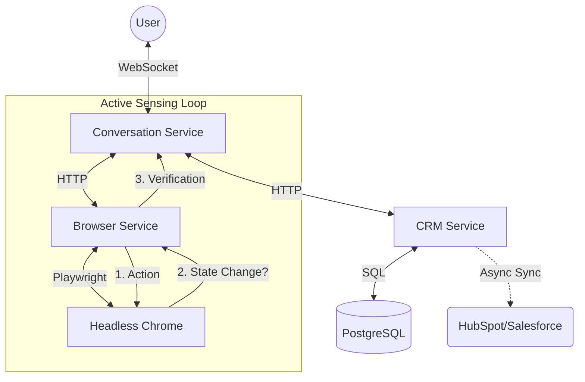

# Keeto Sales Agent 🤖

A high-performance, AI-powered Sales Agent capable of conducting live software demos via browser automation. Built with **active sensing** architecture to ensure reliability on any hardware.

## 🚀 Key Innovation: "Active Sensing" Agent
Unlike traditional "fire-and-forget" automation, this agent verifies every action before proceeding. It doesn't just "click" — it **senses**.

| Feature | How It Works | Benefit |
|---------|--------------|---------|
| **Active Sensing** | Clicks verify URL changes + Video State (paused/playing) | **Zero "Blind" Failures** (Agent won't lie about actions) |
| **Split Brain Loop** | Voice & Action pipelines run in parallel | **<1s Latency** for voice responses while actions load |
| **Speed Mode** | Uses `domcontentloaded` + Pre-warming | **Instant Demo** start (0s latency on "Start") |
| **Robustness** | Auto-dismisses popups, uses Keyboard Fallbacks | Works even when CSS selectors fail |

## 📁 Architecture



### Core Services
- **Conversation Service**: The "Brain". Uses LangGraph to manage state, retry logic, and split-brain voice generation.
- **Browser Service**: The "Hands". A specialized Playwright API that reports rich state (video time, player status, URL) instead of just success/fail.
- **CRM Service**: The "Closer". Captures leads instantly to a local buffer and syncs them to HubSpot/Salesforce in the background. Features provider-agnostic adapters and automated email follow-ups.
- **Frontend**: React-based UI with glassmorphism design, real-time MJPEG stream, and voice visualization.

## 🛠️ Quick Start

### Prerequisites
- Docker & Docker Compose
- Groq/Gemini API Key

### 1. Setup Environment
```bash
# Create .env file
# Create .env file with CRM settings
cat <<EOF > .env
GEMINI_API_KEY=your-gemini-key
GROQ_API_KEY=your-groq-key

# CRM Configuration (Optional)
CRM_PROVIDER=hubspot # or salesforce
HUBSPOT_ACCESS_TOKEN=your-token
EMAIL_SENDER=your-email@gmail.com
EMAIL_PASSWORD=your-app-password
EOF
```

### 2. Run the Stack
```bash
# Build and start all services
docker compose up -d --build
```

### 3. Access the Agent
- **Frontend**: http://localhost:3000
- **Browser Stream**: http://localhost:8001/stream

## 🎯 Demo Capabilities
Say **"Show me a demo"** to start the guided YouTube pilot.

The agent will:
1. **Navigate** to YouTube (Pre-warmed in background for speed)
2. **Search** for "Artificial Intelligence" (Handles popups/overlays)
3. **Select** a video (Uses Keyboard fallback if clicks fail)
4. **Control Playback** (Pause/Play using "K" shortcut)

**Interrupt It!**
You can say "Pause video", "Search for cats", or "Stop" *at any time* during the demo. The agent handles interrupts gracefully.

## ⚡ Performance Optimizations
We implemented a "Speed Mode" to run on standard hardware:
- **No `networkidle`**: We use `domcontentloaded` to avoid waiting for slow analytics requests.
- **Aggressive Pre-warming**: The browser navigates to the target site *while the agent introduces itself*.
- **Fast Polling**: Verification loops run at **10Hz (0.1s)** for instant responsiveness.

## 🔧 Troubleshooting

**"Video selection issue"**
- The agent includes a 4-layer fallback system:
    1. Dismiss Popups (Cookie consent, Sign-in)
    2. Wait for Results to render
    3. CSS Click
    4. **Keyboard Navigation (Tab+Enter)** as failsafe

**High Latency?**
- Ensure Docker has access to at least 4GB RAM. The agent is optimized for "Potato Hardware" but Chrome needs memory.

## 📝 License
MIT